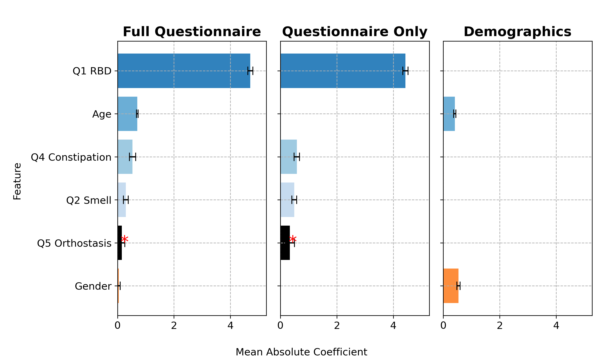
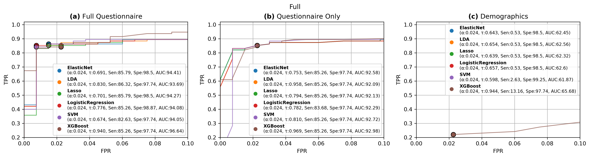

# iRBD Classification Project

## Objective

This project aims to classify individuals with isolated REM Sleep Behavior Disorder (iRBD) using machine learning models trained on questionnaire data and clinical features. We benchmark various modeling strategies (e.g., Elastic Net, XGBoost) and assess their performance using cross-validation and train/test split strategies. Additionally, we identify key predictive features and explore optimal decision thresholds tailored to clinical use cases.

## Take Home
This project demonstrates the feasibility and clinical relevance of using questionnaire data, complemented by demographic and biomarker information, to accurately identify individuals with isolated REM Sleep Behavior Disorder (iRBD). Our results show that machine learning models—particularly Elastic Net and XGBoost—achieve high diagnostic performance, with specificity consistently above 88% and sensitivity exceeding 73% across cross-validation and test scenarios. The models' ability to maintain strong performance even in reduced-feature configurations highlights their potential for scalable screening applications. These findings support the integration of cost-effective data-driven tools into early iRBD detection workflows, paving the way for proactive interventions in the prodromal phase of synucleinopathies.

## Project Structure and Scripts

Below is the execution order and description of each script:

---

### 1. `pre_process_questionnaire.py`

**Purpose:**
Cleans and processes the raw questionnaire and clinical data. Outputs a structured and cleaned dataset used for all subsequent analyses.

**Output:**

* `processed_data.csv`

---

### 2. `generate_table_one.py`

**Purpose:**
Generates descriptive statistics for the population and compares clinical/demographic features between iRBD and control groups using statistical tests.

**Output:**

* Summary table with p-values and effect sizes for each variable (`table_one.csv`)
* Key variables include gender, age, RBD symptoms, smell loss, and constipation.
* Significant variables (e.g., Q1 RBD `p < 1e-30`, Age `p = 0.0078`, Gender `p = 0.048`) suggest distinct clinical profiles between groups.

---

### 3. `main_full_and_cross_val.py`

**Purpose:**
Runs the two main evaluation strategies:

* **Stage I**: Full dataset split into training and test sets. Optimizes hyperparameters and reports classification metrics (AUC, specificity, sensitivity).
* **Stage II**: 5-fold cross-validation on the entire dataset, reporting averaged performance.

**Best Model Summary:**

* **Stage I:** Elastic Net with full feature set
  AUC = 0.928, Specificity = 0.892, Sensitivity = 0.742

* **Stage II:** XGBoost (specificity-weighted)
  AUC = 0.918 ± 0.021, Specificity = 0.884 ± 0.054, Sensitivity = 0.735 ± 0.057

**Output:**

* ROC curve plots for each model
* Final test performance metrics
* Optimal thresholds (`τ`) for sensitivity/specificity tradeoffs

---

### 4. `optmize_xgboost_loss_weight.py`

**Purpose:**
Tunes the class weight parameter in XGBoost to maximize specificity while maintaining acceptable sensitivity. Outputs optimal weight for classification loss.

---

### 5. `roc_curve_plots_veto_tresh.py`

**Purpose:**
Generates ROC curves for various models and thresholds. It also applies post-processing “veto” rules (e.g., applying HLA biomarker exclusion) and visualizes changes in classification performance.

**Output:**

* `roc_curves_with_veto.png`
* Cutoff comparisons with and without biomarker filtering

---

## Figures

### 🔹 **Elastic Net Feature Importance**

* Visualized using bar plots showing standardized weights across 5 folds.
* Top predictors: Q1 RBD (β = 1.84 ± 0.12), Q2 Smell (β = 0.91 ± 0.10), Age (β = -0.75 ± 0.08)

<p align="center">
  
</p>

---

### 🔹 **ROC Curve Summary**

* ROC curves for each model (Elastic Net, XGBoost) with AUC values and optimal τ thresholds.
* Separate plots with and without HLA veto rules for improved interpretability.

<p align="center">
  
</p>

---

## Usage

To reproduce the results:

```bash
# Step 1: Preprocess data
python pre_process_questionnaire.py

# Step 2: Generate descriptive statistics
python generate_table_one.py

# Step 3: Run ML pipelines
python main_full_and_cross_val.py

# Step 4: Optimize class weight for XGBoost
python optmize_xgboost_loss_weight.py

# Step 5: Plot ROC curves
python roc_curve_plots_veto_tresh.py
```

## Contact

For questions or contributions, please contact \[Your Name] or open an issue in the repository.

---

Let me know if you'd like this in markdown format or as a downloadable `.md` file.
